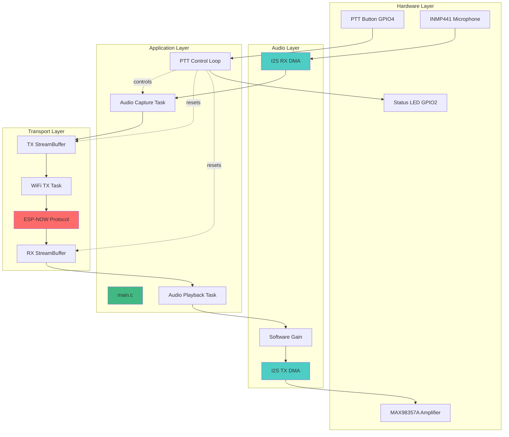

# 🎙️ ESP32 ESP-NOW Walkie-Talkie - Tài Liệu Kiến Trúc

> Hệ thống truyền thông âm thanh thời gian thực sử dụng ESP32 và giao thức ESP-NOW

## 📋 Tổng Quan Dự Án

**Tên dự án:** Doppler Walkie-Talkie  
**Platform:** ESP-IDF (ESP32-WROOM-32)  
**Giao thức:** ESP-NOW (Connectionless Broadcast)  
**Mục tiêu:** Truyền âm thanh hai chiều với độ trễ < 100ms

---

## 🎯 Mục Tiêu Hệ Thống

### Chức Năng Chính
- ✅ Truyền âm thanh real-time qua ESP-NOW
- ✅ Chế độ Push-to-Talk (PTT) half-duplex
- ✅ Độ trễ end-to-end < 100ms
- ✅ Chất lượng âm thanh rõ ràng (8kHz, 16-bit, Mono)

### Thông Số Kỹ Thuật
| Thông Số | Giá Trị |
|----------|---------|
| **Sample Rate** | 8,000 Hz |
| **Bit Depth** | 16-bit |
| **Channels** | Mono |
| **Packet Size** | 244 bytes (240 bytes payload + 4 bytes header) |
| **Latency Target** | < 100ms |
| **Protocol** | ESP-NOW Broadcast |

---

## 🏗️ Kiến Trúc Tổng Quan



---

## 📦 Tech Stack

### Framework & SDK
- **ESP-IDF v5.x** - ESP32 development framework
- **FreeRTOS** - Real-time operating system
- **ESP-NOW** - Connectionless Wi-Fi protocol

### Hardware Components
- **ESP32-WROOM-32** - Main MCU
- **INMP441** - I2S MEMS Microphone
- **MAX98357A** - I2S Class-D Amplifier
- **Push Button** - PTT control (Active Low)
- **LED** - Status indicator

### Core Modules
```
main/
├── main.c              # Entry point, task orchestration
├── app_config.h        # Configuration constants
├── audio_driver.c/h    # I2S audio interface
├── wifi_transport.c/h  # ESP-NOW transport layer
└── board_pinout.h      # GPIO pin definitions
```

---

## 🔑 Key Features

### Phase 4 Enhancements (Current)
1. **PTT State Machine**
   - Chỉ capture audio khi PTT được nhấn
   - Reset buffers khi chuyển mode
   
2. **Pre-buffering Logic**
   - Đợi 10 packets (~2.4KB) trước khi phát
   - Giảm jitter và dropout
   
3. **Increased DMA Buffers**
   - Speaker DMA buffers: 4 → 16
   - Giảm underrun khi phát audio

4. **Software Gain Control**
   - Configurable gain (0-18 dB)
   - Clipping protection

---

## 📖 Cách Sử Dụng Tài Liệu Này

### Cho Developers
1. **Bắt đầu:** Đọc [Tổng Quan Hệ Thống](layers/overview.md)
2. **Hiểu Flows:** Xem [Workflows](workflows/ptt-transmission.md)
3. **Deep Dive:** Phân tích [Source Code](deepdive/main.md)

### Cho Architects
1. Xem [System Architecture Diagram](diagrams/system.md)
2. Đọc [Layer Documentation](layers/overview.md)
3. Review [Expert Analysis](#)

---

## 🚀 Quick Start

### Chạy Documentation Server
```bash
cd docs_architecture
python3 -m http.server 3001
```

Mở trình duyệt: **http://localhost:3001**

---

## 📝 Changelog

| Version | Date | Changes |
|---------|------|---------|
| **Phase 4** | 2024-12 | PTT state machine, pre-buffering, DMA optimization |
| **Phase 3** | 2024-12 | StreamBuffer integration, full audio streaming |
| **Phase 2** | 2024-11 | ESP-NOW transport layer |
| **Phase 1** | 2024-11 | I2S audio driver, basic GPIO |

---

## 👥 Contributors

Tài liệu này được tạo tự động từ source code analysis.

---

**Lưu ý:** Tài liệu này được tạo bằng [Docsify](https://docsify.js.org/) với [Mermaid](https://mermaid.js.org/) diagrams.
