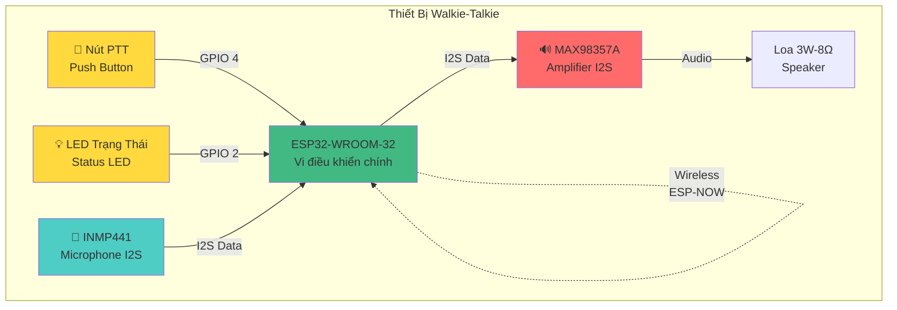
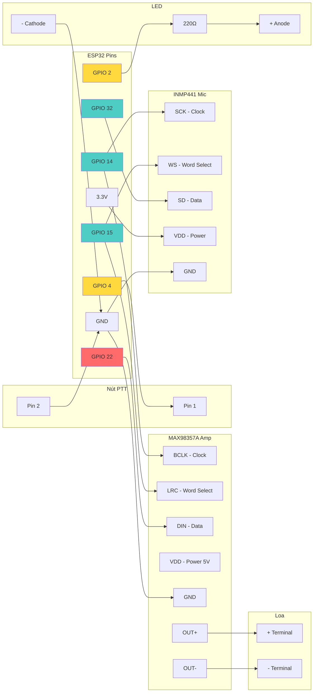
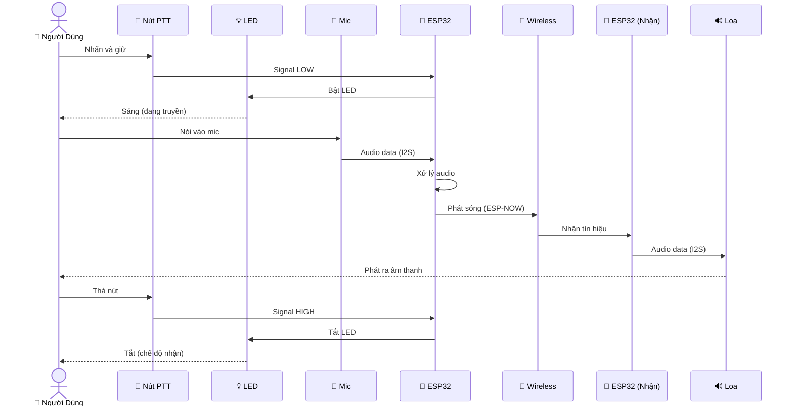
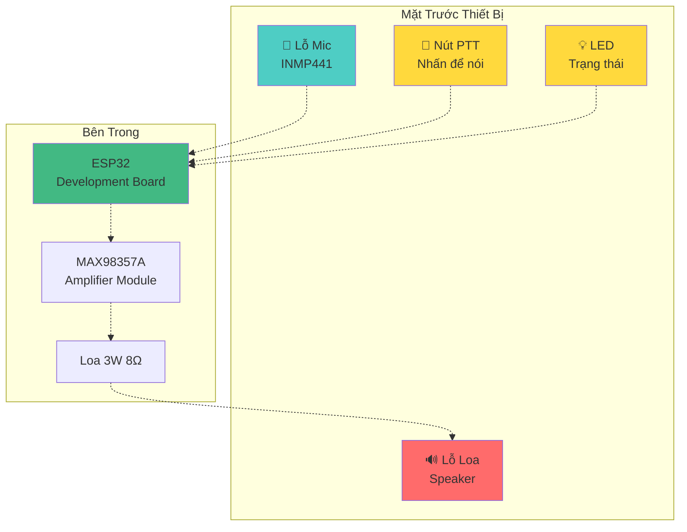

# 🔌 Sơ Đồ Kết Nối Phần Cứng

## Sơ Đồ Đơn Giản - Hardware Connections

---

## Sơ Đồ Chi Tiết - Pinout Connections

---

## Sơ Đồ Hoạt Động - Truyền Âm Thanh

---

## Bảng Kết Nối Nhanh

### ESP32 → Nút PTT
| ESP32 Pin | Nút PTT | Chức năng |
|-----------|---------|-----------|
| GPIO 4 | Pin 1 | Input (Pull-up) |
| GND | Pin 2 | Ground |

### ESP32 → LED
| ESP32 Pin | LED | Chức năng |
|-----------|-----|-----------|
| GPIO 2 | Anode (+) qua 220Ω | Output |
| GND | Cathode (-) | Ground |

### ESP32 → INMP441 Microphone
| ESP32 Pin | INMP441 | Chức năng |
|-----------|---------|-----------|
| GPIO 14 | SCK | I2S Clock |
| GPIO 15 | WS | Word Select |
| GPIO 32 | SD | Data Input |
| 3.3V | VDD | Power |
| GND | GND | Ground |
| - | L/R | GND (Left channel) |

### ESP32 → MAX98357A Amplifier
| ESP32 Pin | MAX98357A | Chức năng |
|-----------|-----------|-----------|
| GPIO 14 | BCLK | I2S Clock |
| GPIO 15 | LRC | Word Select |
| GPIO 22 | DIN | Data Output |
| 5V | VIN | Power (hoặc 3.3V) |
| GND | GND | Ground |

### MAX98357A → Loa
| MAX98357A | Loa | Chức năng |
|-----------|-----|-----------|
| OUT+ | + Terminal | Positive |
| OUT- | - Terminal | Negative |

---

## Sơ Đồ Vật Lý - Layout Đơn Giản

---

## Lưu Ý Quan Trọng

### ⚡ Nguồn Điện
- **ESP32:** 3.3V (từ USB hoặc pin)
- **INMP441:** 3.3V
- **MAX98357A:** 5V (hoặc 3.3V, nhưng 5V cho âm lượng lớn hơn)
- **Loa:** 3W 8Ω (hoặc 4Ω)

### 🔧 Lắp Ráp
1. Kết nối INMP441 vào ESP32 (I2S RX)
2. Kết nối MAX98357A vào ESP32 (I2S TX)
3. Kết nối loa vào MAX98357A
4. Kết nối nút PTT vào GPIO 4
5. Kết nối LED vào GPIO 2 (qua điện trở 220Ω)

### ⚠️ Chú Ý
- **I2S Clock chung:** GPIO 14 và GPIO 15 dùng chung cho cả mic và loa
- **Pull-up:** Nút PTT cần pull-up (đã enable internal pull-up)
- **Điện trở LED:** Bắt buộc dùng 220Ω để bảo vệ LED
- **Gain:** MAX98357A có jumper để điều chỉnh gain (9dB hoặc 15dB)

---

**Xem thêm:**
- [Sơ Đồ Phức Tạp →](system.md)
- [Wiring Guide →](../../WIRING_GUIDE.md)
