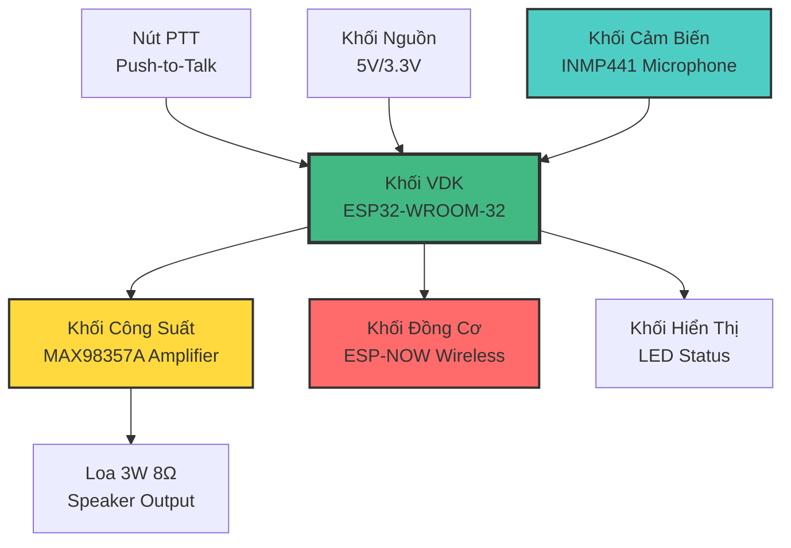
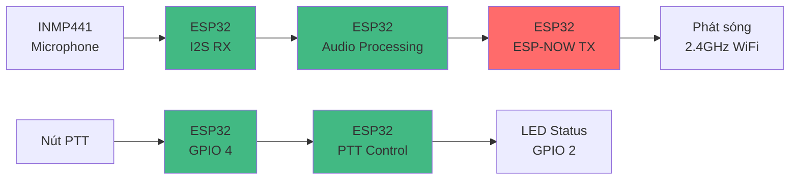
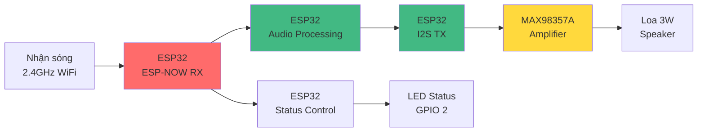
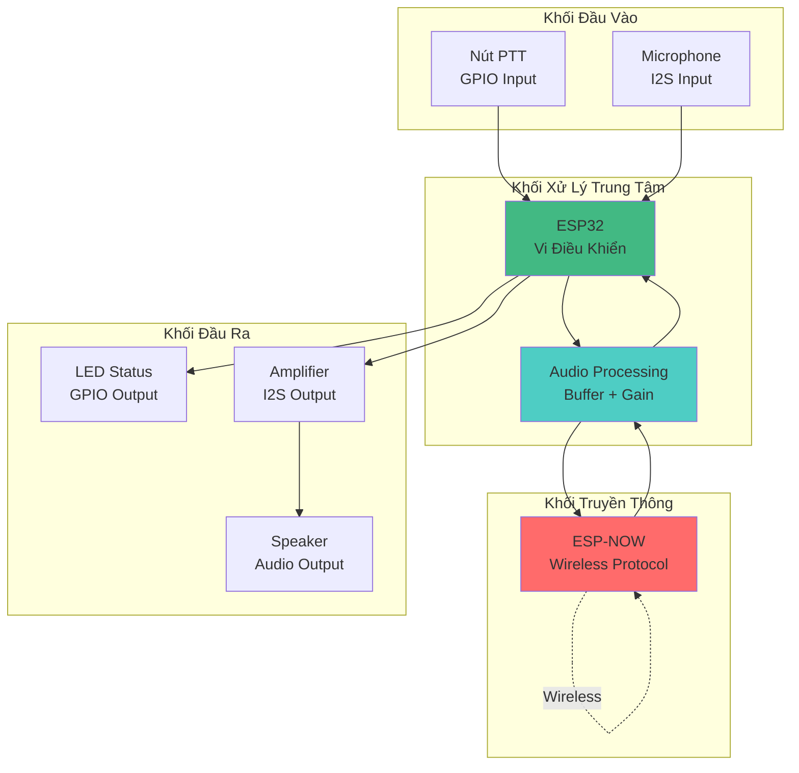

# 📐 Sơ Đồ Khối Đơn Giản - ESP32 Walkie-Talkie

## Sơ Đồ Khối Hệ Thống



---

## Sơ Đồ Khối Chi Tiết - Thiết Bị Phát (TX)



---

## Sơ Đồ Khối Chi Tiết - Thiết Bị Nhận (RX)



---

## Sơ Đồ Khối Đầy Đủ - Cả 2 Thiết Bị

```mermaid
graph TB
    subgraph "Thiết Bị A - Người Nói"
        A1[Nút PTT] --> A2[ESP32]
        A3[Mic INMP441] --> A2
        A2 --> A4[LED]
        A2 --> A5[ESP-NOW TX]
    end
    
    A5 -.Wireless<br/>2.4GHz.-> B5
    
    subgraph "Thiết Bị B - Người Nghe"
        B5[ESP-NOW RX] --> B2[ESP32]
        B2 --> B3[MAX98357A]
        B3 --> B4[Loa]
        B2 --> B6[LED]
    end
    
    style A2 fill:#42b983
    style B2 fill:#42b983
    style A5 fill:#ff6b6b
    style B5 fill:#ff6b6b
```

---

## Sơ Đồ Khối Theo Chức Năng



---

## Bảng Mô Tả Các Khối

| Khối | Tên | Chức Năng | Linh Kiện |
|------|-----|-----------|-----------|
| **Khối VDK** | Vi Điều Khiển | Xử lý trung tâm, điều khiển toàn bộ hệ thống | ESP32-WROOM-32 |
| **Khối Nguồn** | Nguồn Điện | Cấp nguồn 5V và 3.3V | USB hoặc Pin |
| **Khối Cảm Biến** | Microphone | Thu âm thanh, chuyển thành tín hiệu số | INMP441 I2S |
| **Khối Công Suất** | Amplifier | Khuếch đại tín hiệu âm thanh | MAX98357A |
| **Khối Đồng Cơ** | Wireless | Truyền/nhận dữ liệu không dây | ESP-NOW Protocol |
| **Khối Hiển Thị** | LED Status | Hiển thị trạng thái hoạt động | LED đơn |
| **Khối Đầu Vào** | PTT Button | Điều khiển chế độ phát/nhận | Nút nhấn |
| **Khối Đầu Ra** | Speaker | Phát âm thanh ra ngoài | Loa 3W 8Ω |

---

## Sơ Đồ Luồng Dữ Liệu


---

**Lưu ý:** Các sơ đồ trên được vẽ theo phong cách đơn giản, dễ hiểu, phù hợp để trình bày hoặc làm tài liệu kỹ thuật.
