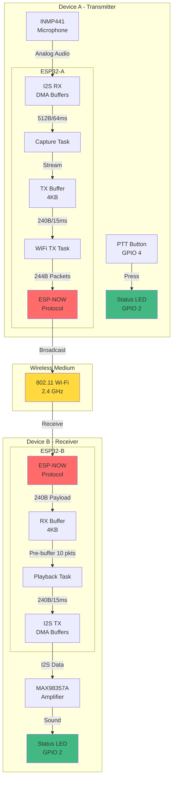
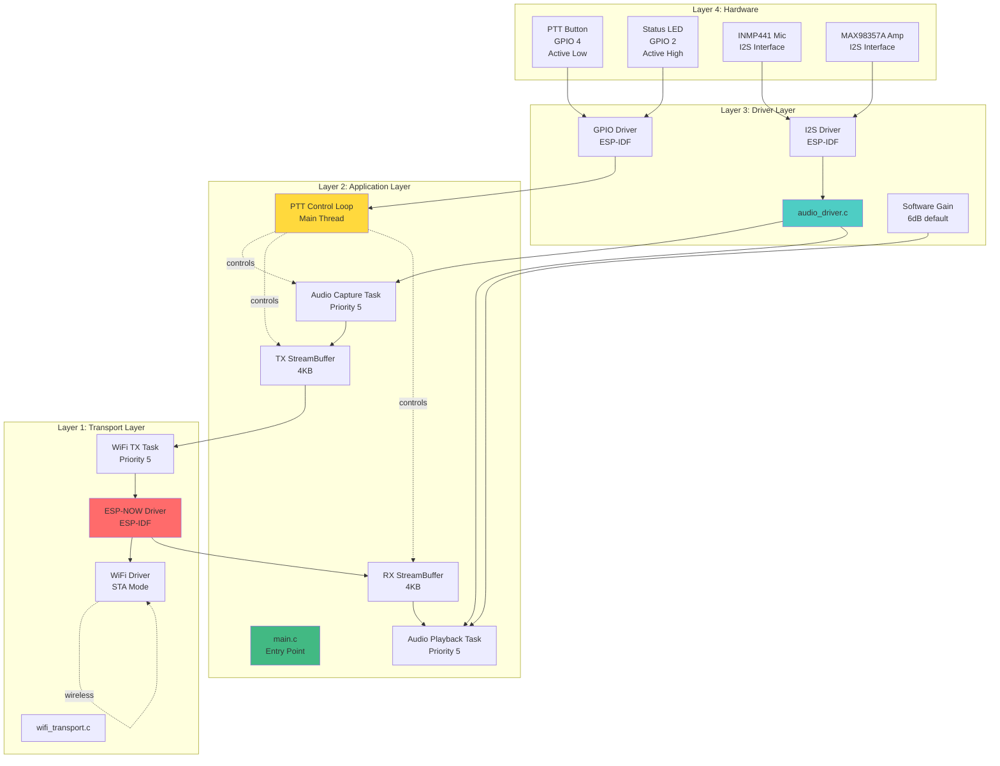
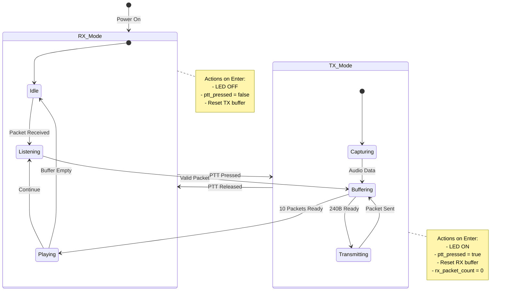
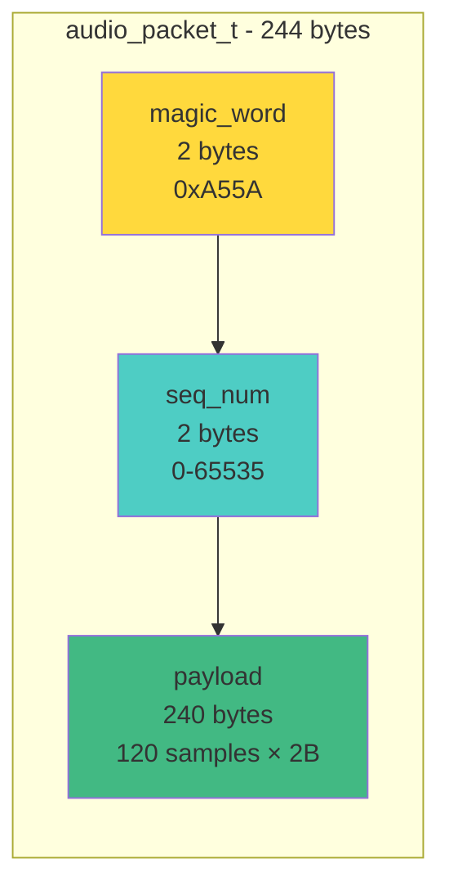
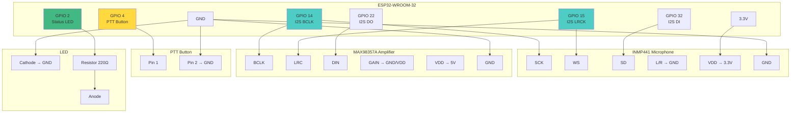
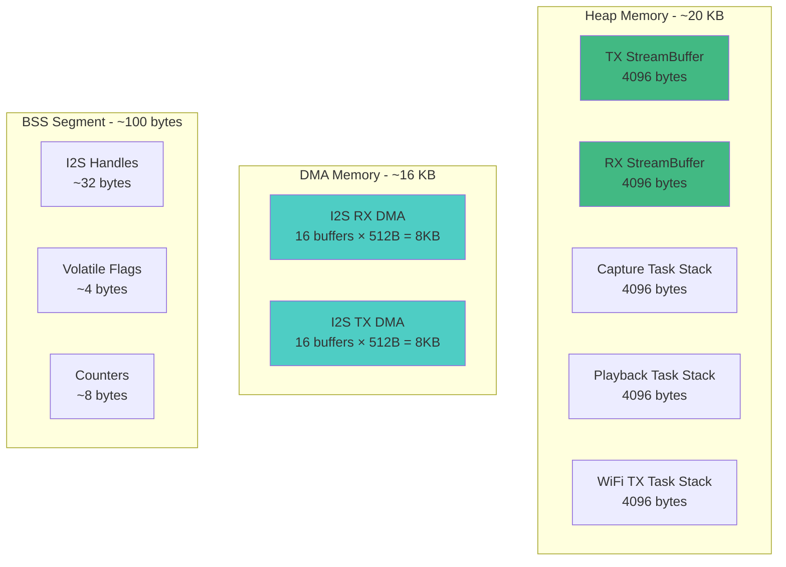

# 📊 Sơ Đồ Khối Hệ Thống

## 1. Sơ Đồ Tổng Quan Hệ Thống

---

## 2. Sơ Đồ Kiến Trúc Phân Tầng

---

## 3. Sơ Đồ Data Flow - TX Path

```mermaid
flowchart LR
    subgraph "Hardware Input"
        MIC[🎤 INMP441<br/>Microphone]
    end
    
    subgraph "I2S Layer"
        I2S_RX[I2S RX Channel<br/>8kHz, 16-bit, Mono]
        DMA_RX[DMA Buffer<br/>16 × 256 samples]
    end
    
    subgraph "Application Layer"
        CAP_TASK[Capture Task<br/>512 bytes/read]
        TX_BUF[TX StreamBuffer<br/>4096 bytes]
    end
    
    subgraph "Transport Layer"
        WIFI_TASK[WiFi TX Task<br/>240 bytes/packet]
        PACKET[Packet Creation<br/>magic + seq + payload]
        ESP_NOW[ESP-NOW Send<br/>244 bytes]
    end
    
    subgraph "Wireless"
        AIR[📡 Broadcast<br/>FF:FF:FF:FF:FF:FF]
    end
    
    MIC -->|Analog| I2S_RX
    I2S_RX -->|DMA| DMA_RX
    DMA_RX -->|512B/64ms| CAP_TASK
    CAP_TASK -->|xStreamBufferSend| TX_BUF
    TX_BUF -->|xStreamBufferReceive| WIFI_TASK
    WIFI_TASK -->|Serialize| PACKET
    PACKET -->|esp_now_send| ESP_NOW
    ESP_NOW -->|Wireless| AIR
    
    style MIC fill:#42b983
    style AIR fill:#ff6b6b
    style TX_BUF fill:#4ecdc4
```

---

## 4. Sơ Đồ Data Flow - RX Path

```mermaid
flowchart LR
    subgraph "Wireless"
        AIR[📡 Broadcast<br/>Received]
    end
    
    subgraph "Transport Layer"
        ESP_NOW[ESP-NOW Callback<br/>Interrupt Context]
        VALIDATE[Validate<br/>magic + size]
    end
    
    subgraph "Application Layer"
        RX_BUF[RX StreamBuffer<br/>4096 bytes]
        PRE_BUF[Pre-buffering<br/>Wait 10 packets]
        PLAY_TASK[Playback Task<br/>240 bytes/read]
    end
    
    subgraph "I2S Layer"
        GAIN[Software Gain<br/>6dB amplification]
        DMA_TX[DMA Buffer<br/>16 × 256 samples]
        I2S_TX[I2S TX Channel<br/>8kHz, 16-bit, Mono]
    end
    
    subgraph "Hardware Output"
        SPK[🔊 MAX98357A<br/>Amplifier]
    end
    
    AIR -->|Packet| ESP_NOW
    ESP_NOW -->|Validate| VALIDATE
    VALIDATE -->|240B payload| RX_BUF
    RX_BUF -->|Buffer| PRE_BUF
    PRE_BUF -->|xStreamBufferReceive| PLAY_TASK
    PLAY_TASK -->|Apply gain| GAIN
    GAIN -->|240B/15ms| DMA_TX
    DMA_TX -->|DMA| I2S_TX
    I2S_TX -->|I2S Data| SPK
    
    style AIR fill:#ff6b6b
    style SPK fill:#42b983
    style RX_BUF fill:#4ecdc4
    style GAIN fill:#ffd93d
```

---

## 5. Sơ Đồ PTT State Machine

---

## 6. Sơ Đồ Packet Structure

**Packet Details:**
- **Total Size:** 244 bytes (fits ESP-NOW 250B limit)
- **Overhead:** 4 bytes (1.6%)
- **Payload Efficiency:** 98.4%
- **Duration:** 120 samples / 8000 Hz = 15ms
- **Rate:** ~67 packets/second

---

## 7. Sơ Đồ GPIO Pinout

---

## 8. Sơ Đồ Timing - End-to-End Latency

```mermaid
gantt
    title Latency Budget - PTT Press to Audio Output
    dateFormat X
    axisFormat %L ms
    
    section TX Device
    I2S Capture (512B)       :a1, 0, 64
    TX Buffer Wait           :a2, 64, 10
    Packetize                :a3, 74, 1
    
    section Wireless
    ESP-NOW Send             :a4, 75, 5
    Air Propagation          :a5, 80, 5
    
    section RX Device
    ESP-NOW Receive          :a6, 85, 1
    RX Buffer (Pre-buffer)   :a7, 86, 150
    Playback                 :a8, 236, 15
    
    section Total
    First Audio Output       :milestone, 251, 0
```

**Latency Breakdown:**
| Stage | Duration | Percentage |
|-------|----------|------------|
| TX Capture | 64ms | 25.5% |
| TX Buffering | 10ms | 4.0% |
| Wireless | 10ms | 4.0% |
| **RX Pre-buffering** | **150ms** | **59.8%** |
| RX Playback | 15ms | 6.0% |
| **Total** | **251ms** | **100%** |

> ⚠️ **Critical:** Pre-buffering chiếm 60% latency. Giảm xuống 3 packets sẽ giảm latency xuống ~100ms.

---

## 9. Sơ Đồ Memory Layout

**Total Memory Usage:** ~36 KB
- Heap: ~20 KB
- DMA: ~16 KB
- Static: ~100 bytes

---

## 10. Sơ Đồ Task Scheduling

```mermaid
gantt
    title FreeRTOS Task Timeline (100ms window)
    dateFormat X
    axisFormat %L ms
    
    section Main Loop
    PTT Monitoring           :a1, 0, 5
    Idle                     :a2, 5, 45
    PTT Monitoring           :a3, 50, 5
    Idle                     :a4, 55, 45
    
    section Capture Task
    I2S Read (Blocked)       :b1, 0, 64
    Buffer Push              :b2, 64, 1
    I2S Read (Blocked)       :b3, 65, 35
    
    section WiFi TX Task
    Buffer Pop               :c1, 10, 1
    Send Packet              :c2, 11, 5
    Delay                    :c3, 16, 6
    Buffer Pop               :c4, 22, 1
    Send Packet              :c5, 23, 5
    Delay                    :c6, 28, 6
    
    section Playback Task
    Buffer Pop (Blocked)     :d1, 0, 15
    I2S Write                :d2, 15, 1
    Buffer Pop (Blocked)     :d3, 16, 15
    I2S Write                :d4, 31, 1
```

---

**Xem thêm:**
- [System Overview →](../layers/overview.md)
- [PTT Transmission Flow →](../workflows/ptt-transmission.md)
