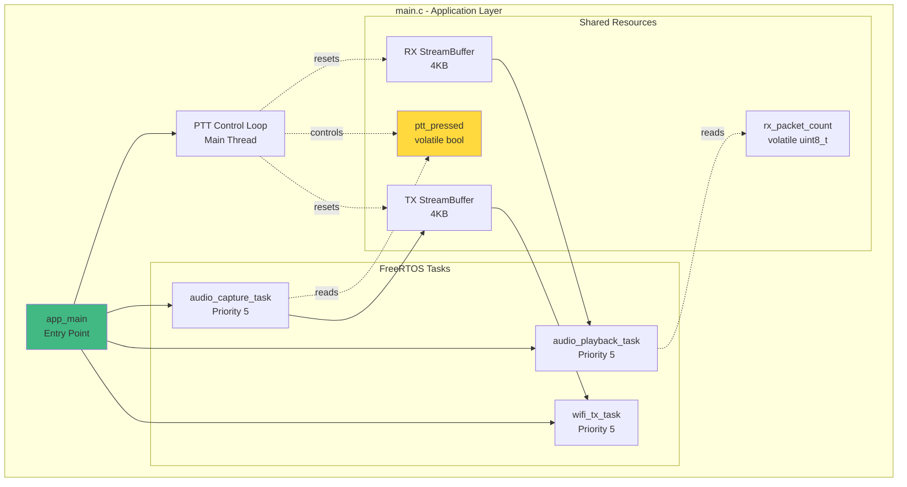
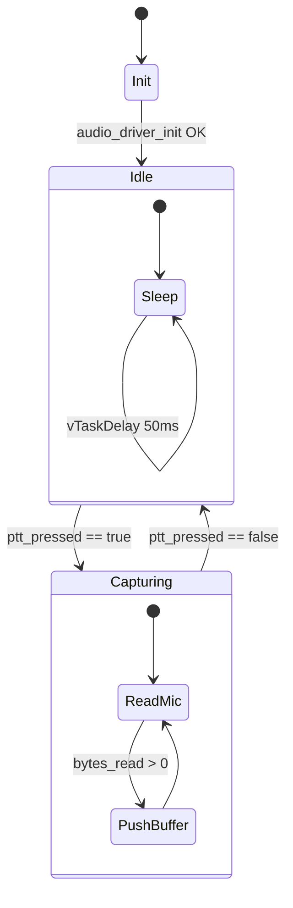
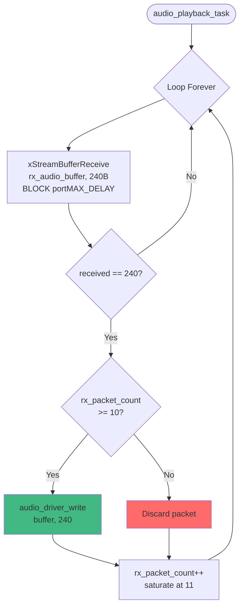
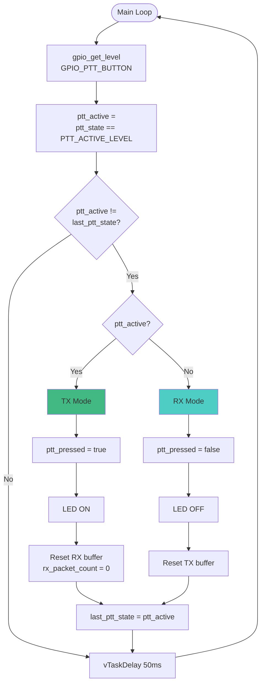
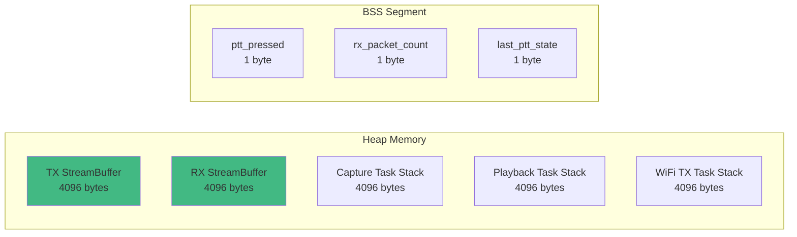

# 🎯 Application Layer - Task Orchestration

> **Module:** `main.c`  
> **Trách nhiệm:** Task management, PTT control, buffer coordination

---

## Architecture Overview



---

## Task Details

### 1. audio_capture_task (Lines 39-77)

**Purpose:** Read from microphone, push to TX buffer when PTT pressed

**Priority:** 5 (Medium)  
**Stack Size:** 4096 bytes  
**Core Affinity:** Any (not pinned)

**State Machine:**


**Key Code:**
```c
// Line 61-67
if (ptt_pressed) {
  esp_err_t ret = audio_driver_read(buffer, buffer_size, &bytes_read);
  if (ret == ESP_OK && bytes_read > 0) {
    xStreamBufferSend(tx_audio_buffer, buffer, bytes_read, 0);
  }
}
```

---

### 2. audio_playback_task (Lines 80-103)

**Purpose:** Pop from RX buffer, write to speaker (with pre-buffering)

**Priority:** 5 (Medium)  
**Stack Size:** 4096 bytes

**Flow:**


---

### 3. wifi_tx_task (External)

**Purpose:** Pop from TX buffer, send via ESP-NOW

**Defined in:** `wifi_transport.c`  
**Priority:** 5 (Medium)  
**Stack Size:** 4096 bytes

See [Transport Layer](../layers/transport.md) for details.

---

## PTT Control Loop (Lines 145-173)

**Purpose:** Monitor PTT button, control LED, manage state transitions

**Polling Rate:** 50ms (20 Hz)



---

## Shared Variables

### Volatile Flags
```c
// Line 20-21
static volatile bool ptt_pressed = false;
static volatile uint8_t rx_packet_count = 0;
```

**Why volatile?**
- Accessed from multiple tasks/contexts
- Prevents compiler optimization
- Ensures memory visibility

**Thread Safety:**
- `ptt_pressed`: Written by main loop, read by capture task
- `rx_packet_count`: Written by RX callback, read by playback task
- **No mutex needed** - Single reader/writer pattern

---

## StreamBuffer Configuration

### TX Buffer (Line 112)
```c
tx_audio_buffer = xStreamBufferCreate(AUDIO_BUFFER_SIZE, 240);
```
- **Size:** 4096 bytes
- **Trigger:** 240 bytes
- **Purpose:** Mic → WiFi

### RX Buffer (Line 119)
```c
rx_audio_buffer = xStreamBufferCreate(AUDIO_BUFFER_SIZE, 240);
```
- **Size:** 4096 bytes
- **Trigger:** 240 bytes
- **Purpose:** WiFi → Speaker

**Why 240 bytes trigger?**
- Matches packet payload size
- Atomic read/write operations
- Prevents partial packets

---

## Memory Layout



**Total Heap Usage:** ~20 KB (buffers + stacks)

---

## Expert Review

### ✅ Strengths
1. **Clean task separation** - Each task has single responsibility
2. **Lock-free communication** - StreamBuffers are thread-safe
3. **Simple state machine** - Easy to understand PTT logic
4. **Low polling overhead** - 50ms is acceptable

### ⚠️ Issues
1. **No task pinning** - Tasks may migrate between cores
2. **Fixed priorities** - All tasks at priority 5
3. **No watchdog** - Hung tasks not detected
4. **No error recovery** - Task failures not handled

### 💡 Recommendations
1. **Pin WiFi task to core 0** - WiFi driver runs on core 0
2. **Increase playback priority** - Prevent speaker underruns
3. **Add task watchdogs** - Detect and recover from hangs
4. **Implement error handling** - Restart tasks on failure
5. **Add telemetry** - Monitor task CPU usage

---

## Related Documents
- [← Transport Layer](transport.md)
- [PTT Transmission Flow →](../workflows/ptt-transmission.md)
- [Deep Dive: main.c →](../deepdive/main.md)
