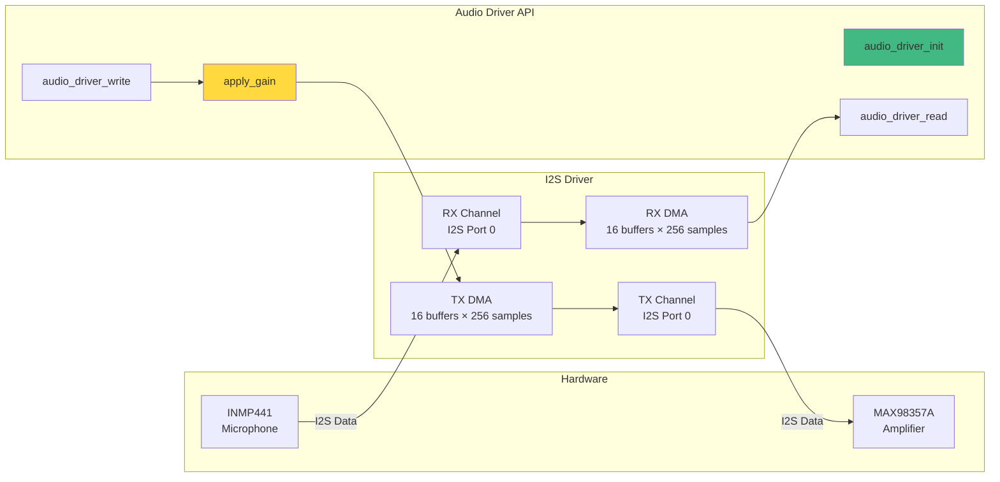
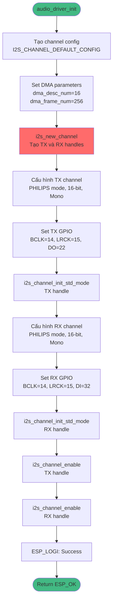
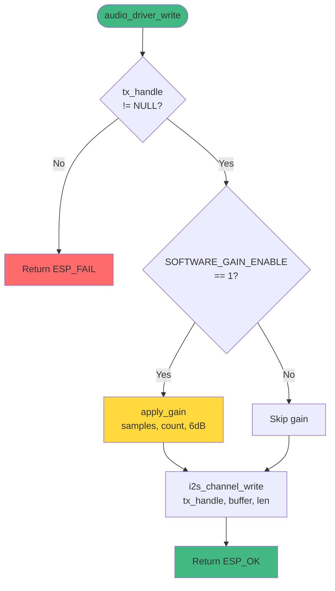
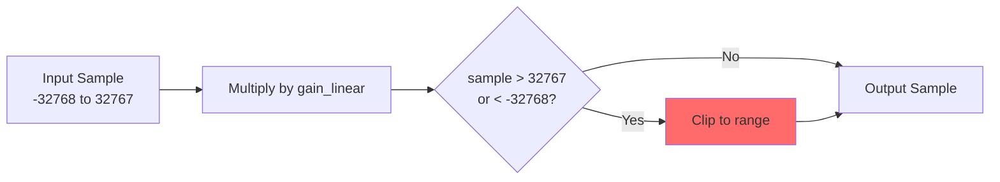
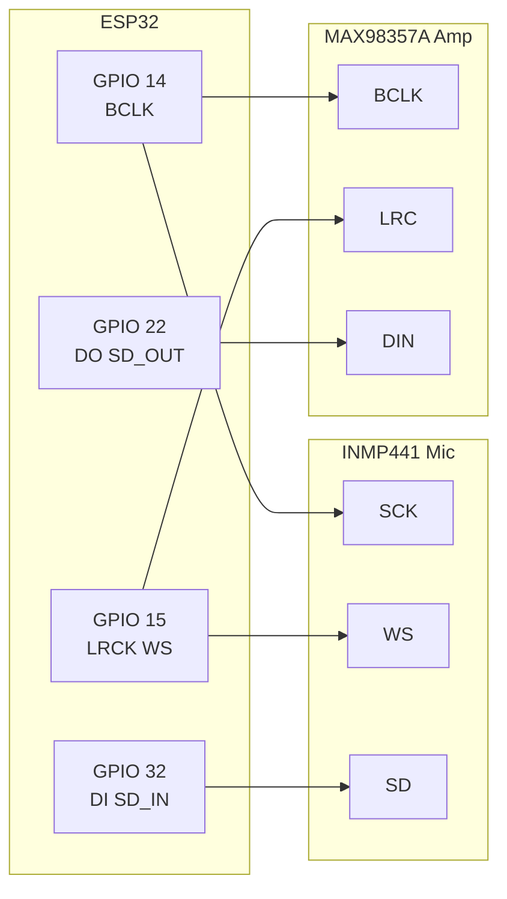

# 🔊 Audio Layer - Chi Tiết Kỹ Thuật

> **Module:** `audio_driver.c` / `audio_driver.h`  
> **Trách nhiệm:** Hardware abstraction cho I2S audio interface

---

## Tổng Quan

Audio Layer cung cấp API đơn giản để capture và playback audio thông qua I2S interface. Layer này xử lý:
- I2S channel initialization (TX và RX)
- DMA buffer management
- Software gain control
- Clipping protection

---

## Architecture Diagram



---

## API Reference

### `audio_driver_init()`
**Mục đích:** Khởi tạo I2S driver với cấu hình Full-Duplex

**Signature:**
```c
esp_err_t audio_driver_init(void);
```

**Cấu hình:**
| Parameter | Value | Description |
|-----------|-------|-------------|
| Sample Rate | 8000 Hz | Voice-optimized |
| Bit Depth | 16-bit | Standard PCM |
| Channels | Mono | Single channel |
| DMA Buffers | 16 | Increased for stability |
| DMA Frame Size | 256 samples | 512 bytes per buffer |

**Flow:**


**Line Numbers:** `23-88` trong `audio_driver.c`

---

### `audio_driver_read()`
**Mục đích:** Đọc audio data từ microphone

**Signature:**
```c
esp_err_t audio_driver_read(void *buffer, size_t len, size_t *bytes_read);
```

**Parameters:**
- `buffer` - Pointer to int16_t array
- `len` - Number of bytes to read (thường 512)
- `bytes_read` - Actual bytes read (output)

**Implementation:**
```c
// Line 90-94
esp_err_t audio_driver_read(void *buffer, size_t len, size_t *bytes_read) {
  if (rx_handle == NULL) {
    return ESP_FAIL;
  }
  return i2s_channel_read(rx_handle, buffer, len, bytes_read, portMAX_DELAY);
}
```

**Timing:**
- **Blocking call** - Đợi cho đến khi có đủ data
- **DMA-driven** - CPU không bị busy-wait
- **Typical duration:** ~64ms (512 bytes / 8000 Hz = 64ms)

---

### `audio_driver_write()`
**Mục đích:** Ghi audio data ra speaker với software gain

**Signature:**
```c
esp_err_t audio_driver_write(const void *buffer, size_t len, size_t *bytes_written);
```

**Flow với Software Gain:**


**Line Numbers:** `122-137` trong `audio_driver.c`

---

## Software Gain Processing

### `apply_gain()` - Internal Function

**Algorithm:**
```c
// Line 103-120
static void apply_gain(int16_t *buffer, size_t sample_count, float gain_db) {
  // Convert dB to linear: gain_linear = 10^(gain_db/20)
  float gain_linear = powf(10.0f, gain_db / 20.0f);
  
  for (size_t i = 0; i < sample_count; i++) {
    // Apply gain
    int32_t sample = (int32_t)(buffer[i] * gain_linear);
    
    // Clipping protection
    if (sample > 32767) {
      sample = 32767;
    } else if (sample < -32768) {
      sample = -32768;
    }
    
    buffer[i] = (int16_t)sample;
  }
}
```

**Gain Table:**
| Gain (dB) | Linear Multiplier | Effect |
|-----------|-------------------|--------|
| 0 | 1.0x | No change |
| 6 | 2.0x | 2× louder |
| 12 | 4.0x | 4× louder |
| 18 | 8.0x | 8× louder |

**Clipping Protection:**


---

## DMA Buffer Configuration

### Buffer Sizing
```c
#define I2S_DMA_BUF_COUNT (16)  // Phase 4: Increased from 4
#define I2S_DMA_BUF_LEN (256)   // Samples per buffer
```

**Total DMA Memory:**
- **Per channel:** 16 buffers × 256 samples × 2 bytes = **8 KB**
- **Both channels:** 8 KB × 2 = **16 KB**

**Latency Impact:**
```
Single buffer duration = 256 samples / 8000 Hz = 32ms
Total buffering = 16 × 32ms = 512ms (worst case)
Typical latency = 1-2 buffers = 32-64ms
```

### Why 16 Buffers?
1. **Prevent underrun** - Speaker needs continuous data
2. **Handle jitter** - WiFi task scheduling variations
3. **Smooth playback** - Avoid audio dropouts

---

## GPIO Pinout

### I2S Connections


**Defined in:** `board_pinout.h`
```c
#define I2S_BCLK_IO  14
#define I2S_LRCK_IO  15
#define I2S_DI_IO    32  // Microphone
#define I2S_DO_IO    22  // Speaker
```

---

## Performance Metrics

### CPU Usage
| Operation | CPU Time | Notes |
|-----------|----------|-------|
| `audio_driver_read()` | ~0.1ms | DMA transfer, minimal CPU |
| `audio_driver_write()` | ~0.5ms | Includes gain processing |
| `apply_gain()` | ~0.4ms | 120 samples × math ops |

### Memory Usage
| Component | Size | Location |
|-----------|------|----------|
| RX DMA buffers | 8 KB | Internal RAM |
| TX DMA buffers | 8 KB | Internal RAM |
| Static handles | ~32 bytes | BSS |
| **Total** | **~16 KB** | |

---

## Configuration Options

### In `app_config.h`
```c
// Enable/disable software gain
#define SOFTWARE_GAIN_ENABLE 1  // 0=OFF, 1=ON

// Gain amount in dB
#define SOFTWARE_GAIN_DB 6.0f   // 0=no change, 6=2x, 12=4x, 18=8x
```

### Tuning Recommendations
1. **Hardware gain first** - Adjust MAX98357A jumper (9dB/15dB)
2. **Software gain second** - Only if hardware gain insufficient
3. **Avoid high gain** - > 12dB may cause distortion
4. **Monitor clipping** - Check for audio artifacts

---

## Expert Review

### ✅ Strengths
1. **Clean API** - Simple init/read/write interface
2. **DMA-based** - Low CPU overhead
3. **Configurable gain** - Flexible volume control
4. **Clipping protection** - Prevents overflow distortion
5. **Increased buffers** - Stable playback (Phase 4 improvement)

### ⚠️ Issues
1. **No dynamic gain** - Gain is compile-time constant
2. **No AGC** - Automatic Gain Control would improve usability
3. **No filtering** - No bandpass filter (300-3400 Hz for voice)
4. **No noise gate** - Background noise always transmitted
5. **Fixed sample rate** - Cannot adapt to network conditions

### 💡 Recommendations
1. **Add AGC** - Automatic level adjustment based on RMS
2. **Implement bandpass filter** - 300-3400 Hz for voice clarity
3. **Add noise gate** - Mute when signal < threshold
4. **Runtime gain control** - Allow dynamic adjustment via GPIO/command
5. **Add audio metering** - Peak/RMS monitoring for debugging
6. **Consider ADPCM** - Compress audio before transmission

---

## Related Documents
- [← Back to Overview](overview.md)
- [Transport Layer →](transport.md)
- [Deep Dive: audio_driver.c →](../deepdive/audio_driver.md)
