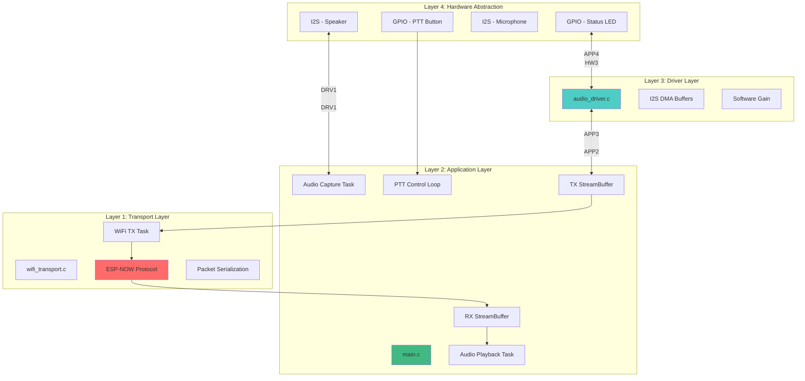
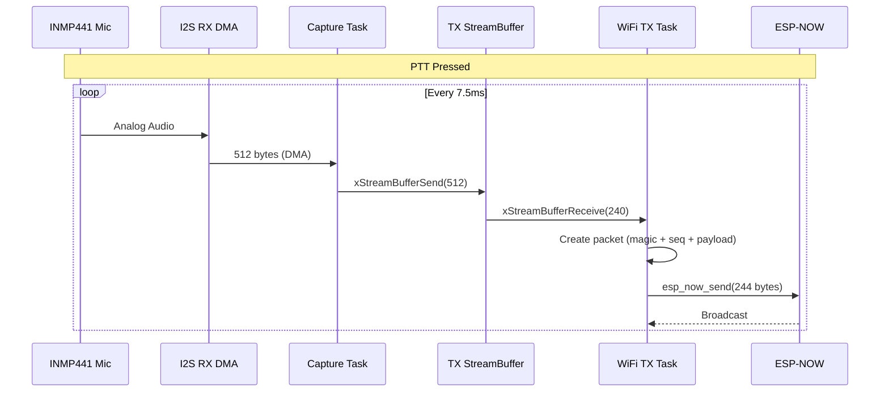
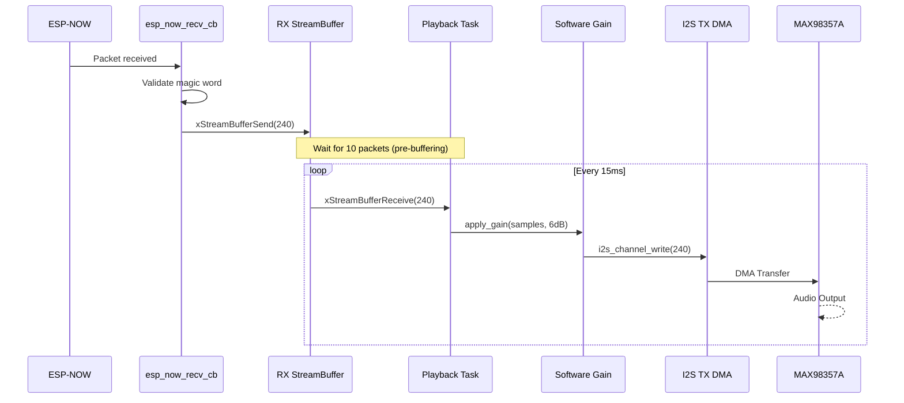

# 🏗️ Tổng Quan Kiến Trúc Hệ Thống

## Mô Hình Phân Tầng

Hệ thống được thiết kế theo mô hình **4 tầng** (Layered Architecture):

---

## Chi Tiết Từng Tầng

### 🔧 Layer 1: Transport Layer
**Trách nhiệm:** Truyền/nhận dữ liệu qua ESP-NOW

**Components:**
- `wifi_transport.c` - ESP-NOW initialization và packet handling
- `wifi_tx_task()` - Task gửi packets từ TX buffer
- `esp_now_recv_cb()` - Callback nhận packets vào RX buffer

**Đặc điểm:**
- Broadcast mode (không cần pairing)
- Packet size: 244 bytes
- Magic word validation (0xA55A)
- Sequence number tracking

---

### 🎵 Layer 2: Application Layer
**Trách nhiệm:** Orchestration, task management, buffer coordination

**Components:**
- `main.c` - Entry point
- `audio_capture_task()` - Đọc từ mic → TX buffer
- `audio_playback_task()` - Đọc từ RX buffer → speaker
- PTT control loop - Monitor button, control LED

**Đặc điểm:**
- FreeRTOS tasks với priority 5
- StreamBuffer cho inter-task communication
- PTT state machine
- Pre-buffering logic (10 packets)

---

### 🔊 Layer 3: Driver Layer
**Trách nhiệm:** Hardware abstraction cho I2S audio

**Components:**
- `audio_driver_init()` - Setup I2S channels
- `audio_driver_read()` - Read from microphone
- `audio_driver_write()` - Write to speaker
- Software gain processing

**Đặc điểm:**
- I2S Full-Duplex mode
- DMA buffers: 16 buffers × 256 samples
- Configurable software gain (0-18 dB)
- Clipping protection

---

### ⚡ Layer 4: Hardware Abstraction
**Trách nhiệm:** GPIO và I2S hardware interface

**Components:**
- GPIO 4 - PTT Button (Active Low, Pull-up)
- GPIO 2 - Status LED (Active High)
- I2S Port 0 - Audio (BCLK: GPIO14, LRCK: GPIO15, DI: GPIO32, DO: GPIO22)

---

## Data Flow Overview

### TX Path (Microphone → ESP-NOW)

### RX Path (ESP-NOW → Speaker)

---

## Timing Analysis

### Packet Timing
| Metric | Value | Calculation |
|--------|-------|-------------|
| **Samples per packet** | 120 | Fixed |
| **Bytes per packet** | 240 | 120 × 2 bytes |
| **Duration per packet** | 15ms | 120 / 8000 Hz |
| **Packets per second** | ~67 | 1000ms / 15ms |
| **Bandwidth** | ~16 KB/s | 244 bytes × 67 |

### Latency Budget
| Stage | Latency | Notes |
|-------|---------|-------|
| **Mic capture** | ~15ms | I2S DMA buffer fill time |
| **TX buffering** | ~7ms | StreamBuffer overhead |
| **ESP-NOW transmission** | ~10ms | Wireless propagation |
| **RX pre-buffering** | ~150ms | 10 packets × 15ms |
| **Speaker playback** | ~15ms | I2S DMA buffer |
| **Total** | **~197ms** | Exceeds 100ms target ⚠️ |

> **Optimization Note:** Pre-buffering có thể giảm xuống 3 packets (~45ms) để đạt target < 100ms, nhưng sẽ tăng risk của audio dropout.

---

## Design Patterns

### 1. Producer-Consumer Pattern
- **Producers:** `audio_capture_task`, `esp_now_recv_cb`
- **Consumers:** `wifi_tx_task`, `audio_playback_task`
- **Queue:** FreeRTOS StreamBuffer (lock-free, single reader/writer)

### 2. State Machine Pattern
- **States:** RX Mode, TX Mode
- **Trigger:** PTT button press/release
- **Actions:** Buffer reset, LED control, task enable/disable

### 3. Callback Pattern
- **ESP-NOW callbacks:** `esp_now_send_cb`, `esp_now_recv_cb`
- **Advantages:** Non-blocking, event-driven

---

## Critical Sections

### Race Conditions
1. **PTT state variable** (`ptt_pressed`)
   - **Protection:** `volatile` keyword
   - **Access:** Main loop (write), Capture task (read)

2. **RX packet counter** (`rx_packet_count`)
   - **Protection:** `volatile` keyword
   - **Access:** RX callback (write), Playback task (read)

### Thread Safety
- **StreamBuffers:** Thread-safe by design (FreeRTOS)
- **ESP-NOW callbacks:** Run in WiFi task context (separate from app tasks)

---

## Expert Review

### ✅ Strengths
1. **Clean separation of concerns** - Mỗi layer có trách nhiệm rõ ràng
2. **Lock-free communication** - StreamBuffer không cần mutex
3. **DMA-based I/O** - Giảm CPU overhead
4. **Configurable gain** - Linh hoạt điều chỉnh volume

### ⚠️ Issues
1. **High latency** - Pre-buffering 10 packets → ~197ms (vượt target 100ms)
2. **No error recovery** - Packet loss không được xử lý
3. **Fixed sample rate** - Không hỗ trợ adaptive bitrate
4. **No encryption** - ESP-NOW broadcast không mã hóa

### 💡 Recommendations
1. **Reduce pre-buffering** - Giảm xuống 3 packets để đạt < 100ms
2. **Add jitter buffer** - Sử dụng adaptive buffering
3. **Implement FEC** - Forward Error Correction cho packet loss
4. **Add compression** - ADPCM hoặc Opus codec để giảm bandwidth
5. **Enable encryption** - Sử dụng ESP-NOW encrypted mode
6. **Add RSSI monitoring** - Hiển thị signal strength trên LED

---

## Next Steps
- [Audio Layer Details →](audio.md)
- [Transport Layer Details →](transport.md)
- [Application Layer Details →](application.md)
