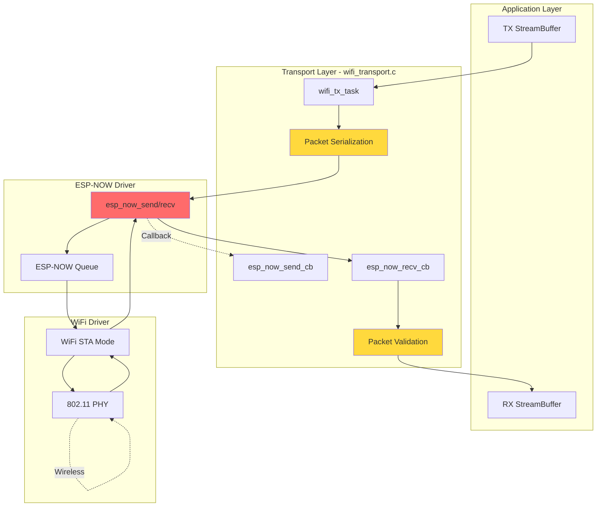
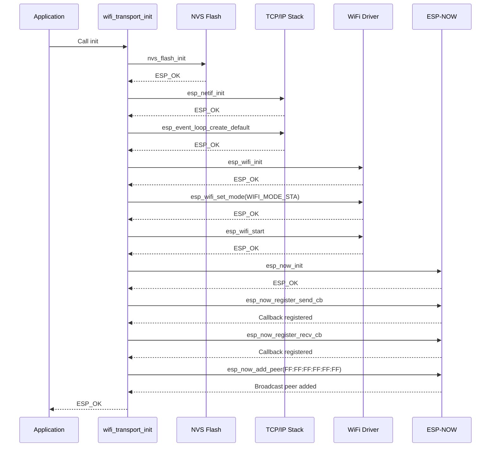
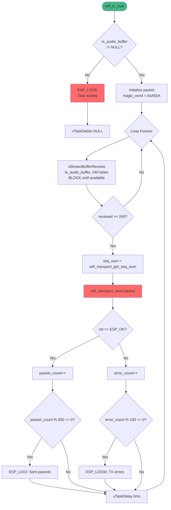
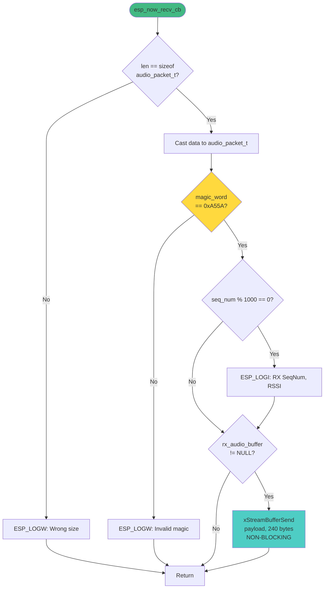

# 📡 Transport Layer - ESP-NOW Protocol

> **Module:** `wifi_transport.c` / `wifi_transport.h`  
> **Trách nhiệm:** Wireless communication qua ESP-NOW broadcast protocol

---

## Tổng Quan

Transport Layer xử lý tất cả communication giữa các thiết bị thông qua ESP-NOW. Layer này cung cấp:
- ESP-NOW initialization
- Packet serialization/deserialization
- Broadcast transmission
- Receive callback handling
- StreamBuffer integration

---

## ESP-NOW Protocol Stack



---

## Packet Structure

### `audio_packet_t` Definition
```c
// Defined in app_config.h (lines 40-47)
typedef struct __attribute__((packed)) {
  uint16_t magic_word;  // 0xA55A - Sync word
  uint16_t seq_num;     // Rolling sequence number
  int16_t payload[120]; // 120 samples × 2 bytes = 240 bytes
} audio_packet_t;
```

**Size Breakdown:**
| Field | Size | Purpose |
|-------|------|---------|
| `magic_word` | 2 bytes | Packet validation |
| `seq_num` | 2 bytes | Ordering & loss detection |
| `payload` | 240 bytes | PCM audio data |
| **Total** | **244 bytes** | Fits ESP-NOW limit (250 bytes) |

**Packet Timing:**
```
Duration per packet = 120 samples / 8000 Hz = 15ms
Packets per second = 1000ms / 15ms ≈ 67 packets/s
Bandwidth = 244 bytes × 67 ≈ 16.3 KB/s
```

---

## Initialization Sequence

### `wifi_transport_init()`



**Line Numbers:** `63-113` trong `wifi_transport.c`

**Key Points:**
- WiFi mode: **Station** (không phải AP)
- Storage: **RAM** (không lưu config vào flash)
- Peer: **Broadcast MAC** (FF:FF:FF:FF:FF:FF)
- Encryption: **Disabled** (broadcast không hỗ trợ encryption)

---

## Transmission Path

### `wifi_tx_task()` - Main TX Loop



**Line Numbers:** `143-193` trong `wifi_transport.c`

**Critical Timing:**
```c
// Line 190: Delay to prevent ESP-NOW queue overflow
vTaskDelay(pdMS_TO_TICKS(6));
```
- **Theoretical:** 240 bytes / 32000 bytes/s = 7.5ms
- **Practical:** ESP-NOW needs ~15ms per packet
- **Chosen:** 6ms (aggressive, may cause queue overflow under load)

---

## Reception Path

### `esp_now_recv_cb()` - Receive Callback



**Line Numbers:** `24-51` trong `wifi_transport.c`

**Validation Steps:**
1. **Size check** - Reject packets != 244 bytes
2. **Magic word check** - Reject packets without 0xA55A
3. **RSSI logging** - Every 1000th packet (for debugging)

---

## Sequence Number Management

### `wifi_transport_get_seq_num()`
```c
// Line 129
static uint16_t seq_num_counter = 0;

uint16_t wifi_transport_get_seq_num(void) { 
  return seq_num_counter++; 
}
```

**Behavior:**
- **Range:** 0 - 65535 (16-bit)
- **Rollover:** Automatic (65535 → 0)
- **Thread-safe:** No (only called from wifi_tx_task)

**Usage:**
- Detect packet loss (gaps in sequence)
- Reorder out-of-order packets (not implemented)
- Debug transmission rate

---

## Broadcast vs Unicast

### Current Implementation: Broadcast
```c
// Line 14
static uint8_t broadcast_mac[6] = {0xFF, 0xFF, 0xFF, 0xFF, 0xFF, 0xFF};
```

**Advantages:**
- ✅ No pairing required
- ✅ Multiple receivers
- ✅ Simple setup

**Disadvantages:**
- ❌ No encryption
- ❌ No ACK (unreliable)
- ❌ Higher collision rate

### Alternative: Unicast
```c
// Example: Specific peer MAC
static uint8_t peer_mac[6] = {0xAA, 0xBB, 0xCC, 0xDD, 0xEE, 0xFF};
```

**Advantages:**
- ✅ Encryption supported
- ✅ ACK available (reliable mode)
- ✅ Lower collision rate

**Disadvantages:**
- ❌ Requires pairing
- ❌ Single receiver only
- ❌ More complex setup

---

## Error Handling

### Send Failures
```c
// Line 179-184
if (ret == ESP_OK) {
  packet_count++;
} else {
  error_count++;  // Count but don't retry
}
```

**Strategy:** **Fire-and-forget**
- No retransmission
- No buffering of failed packets
- Rationale: Real-time audio tolerates loss better than delay

### Receive Failures
- **Invalid size:** Log warning, drop packet
- **Invalid magic:** Log warning, drop packet
- **Buffer full:** `xStreamBufferSend` with timeout=0 → drop packet

---

## Performance Metrics

### Throughput
| Metric | Value | Notes |
|--------|-------|-------|
| **Packet rate** | ~67 packets/s | 15ms per packet |
| **Bandwidth** | ~16.3 KB/s | 244 bytes × 67 |
| **Overhead** | ~4 bytes/packet | Magic + SeqNum |
| **Efficiency** | 98.4% | 240/244 bytes payload |

### Latency Components
| Stage | Latency | Notes |
|-------|---------|-------|
| **StreamBuffer wait** | 0-15ms | Depends on capture rate |
| **Serialization** | < 0.1ms | Negligible |
| **ESP-NOW send** | ~5ms | Queue + MAC layer |
| **Wireless propagation** | ~5ms | Typical for ESP-NOW |
| **Receive callback** | < 0.5ms | Interrupt context |
| **Total TX→RX** | **~10-25ms** | Acceptable for real-time |

---

## Expert Review

### ✅ Strengths
1. **Simple protocol** - Minimal overhead (4 bytes header)
2. **Efficient packing** - 98.4% payload efficiency
3. **Non-blocking RX** - Callback-driven, no polling
4. **Broadcast support** - Multi-device communication
5. **Sequence tracking** - Loss detection capability

### ⚠️ Issues
1. **No error recovery** - Packet loss not handled
2. **No flow control** - Can overflow ESP-NOW queue
3. **No encryption** - Broadcast mode limitation
4. **Fixed delay** - 6ms may be too aggressive
5. **No adaptive rate** - Cannot adjust to network conditions
6. **No jitter buffer** - Relies on pre-buffering in playback task

### 💡 Recommendations
1. **Add FEC** - Forward Error Correction (e.g., Reed-Solomon)
2. **Implement ARQ** - Selective retransmission for critical packets
3. **Add congestion control** - Monitor send failures, back off if needed
4. **Enable encryption** - Switch to unicast mode for security
5. **Adaptive delay** - Adjust based on queue depth
6. **Add timestamp** - For jitter buffer implementation
7. **Implement NACK** - Receiver requests missing packets

---

## Related Documents
- [← Audio Layer](audio.md)
- [Application Layer →](application.md)
- [Deep Dive: wifi_transport.c →](../deepdive/wifi_transport.md)
- [PTT Transmission Flow →](../workflows/ptt-transmission.md)
