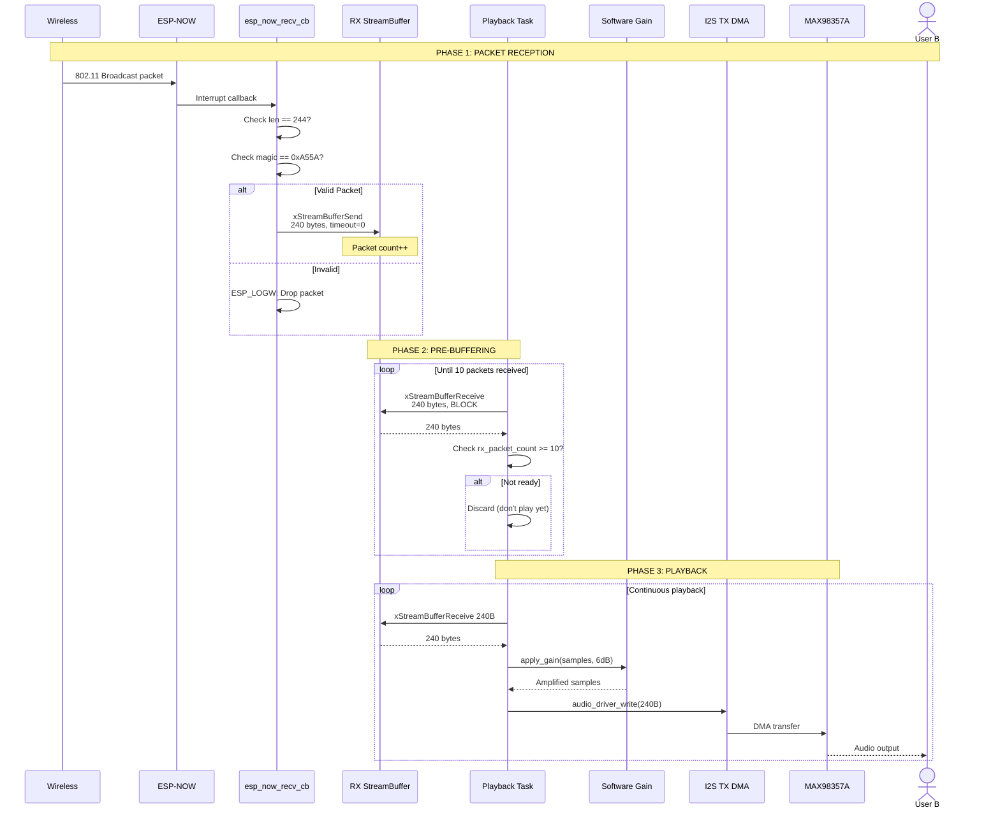
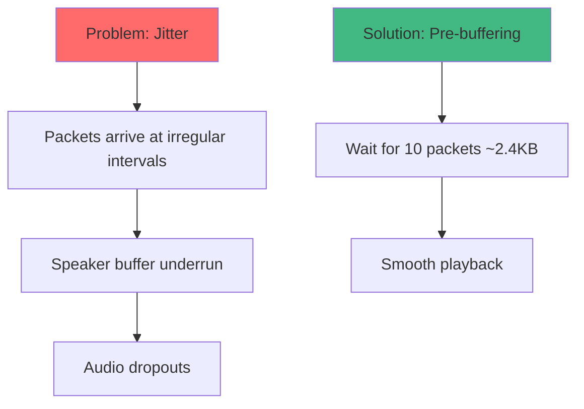
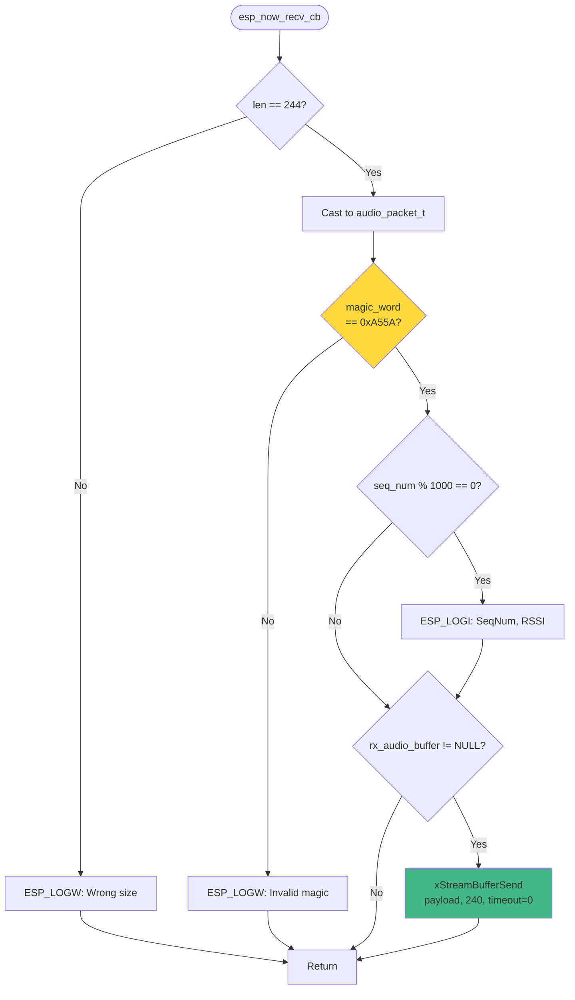

# 🎧 Audio Reception Flow

> **Workflow:** ESP-NOW packet received → Audio played through speaker

---

## Complete Reception Sequence



---

## Pre-Buffering Logic

### Why Pre-Buffer?


### Implementation (main.c:92-100)
```c
if (received == 240) {
  // Phase 4: Only play after receiving at least 10 packets
  if (rx_packet_count >= MIN_PACKETS_BEFORE_PLAY) {
    // Write to Speaker
    audio_driver_write(buffer, 240, &bytes_written);
  }
  // Increment packet count (saturate at MIN_PACKETS_BEFORE_PLAY + 1)
  if (rx_packet_count < MIN_PACKETS_BEFORE_PLAY + 1) {
    rx_packet_count++;
  }
}
```

**MIN_PACKETS_BEFORE_PLAY = 10** (line 22)  
**Buffering time:** 10 packets × 15ms = **150ms**

---

## Packet Validation Flow



**Location:** `wifi_transport.c` lines 24-51

---

## Software Gain Application

### Gain Processing (audio_driver.c:128-133)
```c
#if SOFTWARE_GAIN_ENABLE
  // Apply software gain (cấu hình trong app_config.h)
  int16_t *samples = (int16_t *)buffer;
  size_t sample_count = len / sizeof(int16_t);
  apply_gain(samples, sample_count, SOFTWARE_GAIN_DB);
#endif
```

**Default Gain:** 6 dB = 2× amplification

---

## Timing Analysis

### Reception Timeline

```mermaid
gantt
    title Packet Reception to Playback
    dateFormat X
    axisFormat %L ms
    
    section Receive
    Wireless RX              :a1, 0, 5
    ESP-NOW Callback         :a2, 5, 1
    
    section Buffer
    Push to RX Buffer        :a3, 6, 1
    Wait for 10 packets      :a4, 7, 143
    
    section Playback
    Pop from Buffer          :a5, 150, 1
    Software Gain            :a6, 151, 1
    I2S DMA Write            :a7, 152, 15
    
    section Total
    First Audio Out          :milestone, 167, 0
```


**First packet latency:** ~167ms (includes 150ms pre-buffering)  
**Steady-state latency:** ~17ms per packet

---

## Expert Review

### ✅ Strengths
1. **Robust validation** - Magic word + size check
2. **Pre-buffering** - Prevents dropouts from jitter
3. **Software gain** - Adjustable volume
4. **Non-blocking RX** - Callback-driven

### ⚠️ Issues
1. **High pre-buffer latency** - 150ms exceeds target
2. **No jitter buffer** - Fixed 10-packet wait
3. **No packet loss concealment** - Gaps in audio
4. **No adaptive buffering** - Cannot adjust to network

### 💡 Recommendations
1. **Reduce to 3 packets** - ~45ms buffering
2. **Add adaptive buffer** - Adjust based on jitter
3. **Implement PLC** - Packet Loss Concealment
4. **Add comfort noise** - Fill silent gaps

---

## Related Documents
- [← PTT Transmission Flow](ptt-transmission.md)
- [Audio Layer →](../layers/audio.md)
