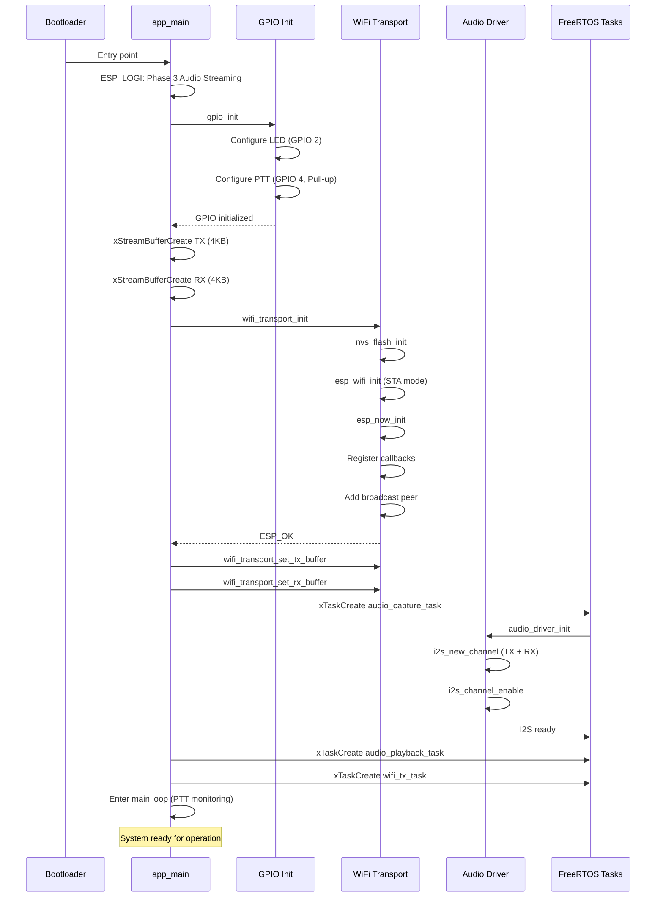

# 🚀 Initialization Sequence

> **Workflow:** Power-on → System ready for PTT operation

---

## Complete Initialization Flow

---

## Initialization Checklist

### Phase 1: GPIO Setup (main.c:24-36)
- ✅ LED configured as output
- ✅ PTT configured as input with pull-up
- ✅ Initial LED state: OFF

### Phase 2: Buffer Creation (main.c:112-124)
- ✅ TX StreamBuffer: 4KB
- ✅ RX StreamBuffer: 4KB
- ✅ Trigger level: 240 bytes

### Phase 3: WiFi & ESP-NOW (wifi_transport.c:63-113)
- ✅ NVS flash initialized
- ✅ WiFi STA mode started
- ✅ ESP-NOW initialized
- ✅ Broadcast peer added

### Phase 4: Audio Driver (audio_driver.c:23-88)
- ✅ I2S channels created
- ✅ TX/RX configured (8kHz, 16-bit, Mono)
- ✅ DMA buffers allocated (16 × 256 samples)
- ✅ Channels enabled

### Phase 5: Task Creation (main.c:134-140)
- ✅ audio_capture_task (Priority 5)
- ✅ audio_playback_task (Priority 5)
- ✅ wifi_tx_task (Priority 5)

---

## Boot Time Estimate

| Stage | Duration | Notes |
|-------|----------|-------|
| Bootloader | ~100ms | ESP32 ROM |
| app_main start | ~50ms | FreeRTOS init |
| GPIO init | < 1ms | Fast |
| WiFi init | ~200ms | Driver load |
| ESP-NOW init | ~50ms | Protocol stack |
| I2S init | ~10ms | DMA setup |
| Task creation | ~5ms | Minimal |
| **Total** | **~416ms** | Ready to use |

---

## Related Documents
- [System Overview →](../layers/overview.md)
