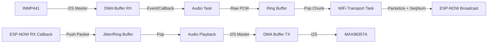

# Implementation Plan: ESP32 ESP-NOW Walkie-Talkie

## 1. Technical Context

### 1.1 Goal
Develop firmware for an ESP32-based Walkie-Talkie using ESP-NOW for low-latency (<100ms) voice communication.

### 1.2 Constitution Check
- **Tech Stack:** ESP32, ESP-IDF v5.1+, C11. Audio: INMP441, MAX98357A. Protocol: ESP-NOW.
- **Standards:** DMA for I2S (Mandatory), FreeRTOS (Mandatory), No malloc in loop, GPIO in header.
- **Status:** COMPLIANT.

## 2. Architecture

### 2.1 Data Flow Diagram


### 2.2 Packet Structure (Network Protocol)
ESP-NOW Max Payload: 250 bytes.
Target Payload Size: 240 bytes audio + header.

**Packet Layout:**
| Field | Size (Bytes) | Description |
| :--- | :--- | :--- |
| `magic` | 2 | Sync word (e.g., 0xA55A) to filter noise. |
| `seq_num` | 2 | Rolling sequence number (0-65535) for ordering/loss detection. |
| `payload` | 240 | PCM Audio Data (16-bit, 120 samples). Time = 7.5ms. |
| **Total** | **244** | Fits within ESP-NOW 250 byte limit. |

### 2.3 Memory Strategy & Latency Calculation
**Audio Specs:** 16kHz, 16-bit Mono = 32,000 bytes/sec.

**DMA Configuration:**
- **Goal:** Minimize CPU interrupt load vs Latency.
- **DMA Buffer Size:** 240 bytes (equal to 1 packet for zero-copy efficiency or easy handling).
- **DMA Count:** 4 buffers.
- **Latency (DMA):** 240 bytes / 32000 Bps = 7.5ms per buffer. Total DMA latency ~30ms (conservative).

**Ring Buffer (Application Layer):**
- **Purpose:** Decouple I2S rate from WiFi TX burstiness.
- **Size:** 4KB (~125ms of audio).
- **Reasoning:** Large enough to absorb WiFi transmission jitters, small enough to keep memory usage low. 

**Total Estimated Latency Pipeline:**
- Capture (7.5ms) -> Processing/Copy (1ms) -> Transmission (2-5ms) -> RX Processing (1ms) -> Playback Buffer (7.5ms)
- **Theoretical Minimum:** ~20-25ms + RF propagation (~negligible).
- **Realistic Buffer:** < 50ms. Well within 100ms requirement.

## 3. Implementation Phases

### Phase 1: Foundation & Drivers
- **Goal:** Get hardware peripherals working.
- **Tasks:**
    - Project Skeleton (CMake, main).
    - `board_pinout.h` definition.
    - I2S Driver implementation (RX/TX/DMA).
    - GPIO/Button Driver.

### Phase 2: Audio Loopback (Local Test)
- **Goal:** Verify Audio quality without WiFi.
- **Tasks:**
    - `audio_driver.c`: Read Mic -> DMA -> Write Amp.
    - Validate Mic gain and Amp volume.

### Phase 3: Wireless Transport
- **Goal:** Send/Receive packets.
- **Tasks:**
    - `wifi_transport.c`: Init ESP-NOW.
    - Packet structure definition (`data_packet_t`).
    - TX Task: Read RingBuffer -> Send ESP-NOW.
    - RX Callback: Receive ESP-NOW -> Write RingBuffer.

### Phase 4: Integration & Optimization
- **Goal:** Full Duplex/PTT Logic.
- **Tasks:**
    - PTT State Machine (RX <-> TX states).
    - Mute logic implementation.
    - LED Status integration.

## 4. File Structure
```text
.
├── CMakeLists.txt
├── main
│   ├── CMakeLists.txt
│   ├── main.c                 # App entry, Task creation, State Machine
│   ├── board_pinout.h         # GPIO definitions (CONSTANTS only)
│   ├── app_config.h           # Audio/WiFi settings (Sample rate, Buffer sizes)
│   ├── audio_driver.c         # I2S Init, Read/Write Wrappers
│   ├── audio_driver.h
│   ├── wifi_transport.c       # ESP-NOW Init, Send/Recv functions
│   ├── wifi_transport.h
│   └── ring_buffer_lib.c/h    # (Optional) Circular buffer util
└── README.md
```
