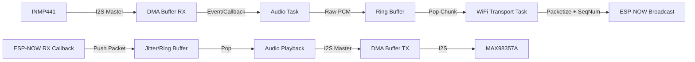

# Kế Hoạch Triển Khai: Bộ Đàm ESP32 ESP-NOW

## 1. Bối Cảnh Kỹ Thuật

### 1.1 Mục Tiêu
Phát triển firmware cho Bộ Đàm dựa trên ESP32 sử dụng ESP-NOW để truyền thông giọng nói độ trễ thấp (<100ms).

### 1.2 Kiểm Tra Constitution
- **Tech Stack:** ESP32, ESP-IDF v5.1+, C11. Audio: INMP441, MAX98357A. Protocol: ESP-NOW.
- **Standards:** DMA cho I2S (Bắt buộc), FreeRTOS (Bắt buộc), Không malloc trong vòng lặp, GPIO trong header.
- **Status:** TUÂN THỦ.

## 2. Kiến Trúc

### 2.1 Sơ Đồ Luồng Dữ Liệu


### 2.2 Cấu Trúc Gói (Giao Thức Mạng)
ESP-NOW Max Payload: 250 bytes.
Target Payload Size: 240 bytes audio + header.

**Bố Cục Gói:**
| Trường | Kích Thước (Bytes) | Mô Tả |
| :--- | :--- | :--- |
| `magic` | 2 | Từ đồng bộ (ví dụ: 0xA55A) để lọc nhiễu. |
| `seq_num` | 2 | Số thứ tự tuần hoàn (0-65535) để sắp xếp/phát hiện mất gói. |
| `payload` | 240 | Dữ Liệu Audio PCM (16-bit, 120 mẫu). Thời gian = 7.5ms. |
| **Tổng** | **244** | Phù hợp với giới hạn 250 byte của ESP-NOW. |

### 2.3 Chiến Lược Bộ Nhớ & Tính Toán Độ Trễ
**Thông Số Audio:** 16kHz, 16-bit Mono = 32,000 bytes/giây.

**Cấu Hình DMA:**
- **Mục Tiêu:** Giảm thiểu tải ngắt CPU so với Độ Trễ.
- **Kích Thước DMA Buffer:** 240 bytes (bằng 1 gói để hiệu quả zero-copy hoặc xử lý dễ dàng).
- **Số Lượng DMA:** 4 buffer.
- **Độ Trễ (DMA):** 240 bytes / 32000 Bps = 7.5ms mỗi buffer. Tổng độ trễ DMA ~30ms (bảo thủ).

**Ring Buffer (Tầng Ứng Dụng):**
- **Mục Đích:** Tách tốc độ I2S khỏi tính bùng nổ của WiFi TX.
- **Kích Thước:** 4KB (~125ms audio).
- **Lý Do:** Đủ lớn để hấp thụ jitter truyền WiFi, đủ nhỏ để giữ mức sử dụng bộ nhớ thấp.

**Tổng Ước Tính Độ Trễ Pipeline:**
- Capture (7.5ms) -> Processing/Copy (1ms) -> Transmission (2-5ms) -> RX Processing (1ms) -> Playback Buffer (7.5ms)
- **Lý Thuyết Tối Thiểu:** ~20-25ms + truyền RF (~không đáng kể).
- **Buffer Thực Tế:** < 50ms. Nằm trong yêu cầu 100ms.

## 3. Các Giai Đoạn Triển Khai

### Giai Đoạn 1: Nền Tảng & Driver
- **Mục Tiêu:** Làm cho các thiết bị ngoại vi phần cứng hoạt động.
- **Nhiệm Vụ:**
    - Project Skeleton (CMake, main).
    - Định nghĩa `board_pinout.h`.
    - Triển khai I2S Driver (RX/TX/DMA).
    - GPIO/Button Driver.

### Giai Đoạn 2: Audio Loopback (Kiểm Tra Cục Bộ)
- **Mục Tiêu:** Xác minh chất lượng Audio mà không có WiFi.
- **Nhiệm Vụ:**
    - `audio_driver.c`: Đọc Mic -> DMA -> Ghi Amp.
    - Xác thực độ khuếch đại Mic và âm lượng Amp.

### Giai Đoạn 3: Truyền Tải Không Dây
- **Mục Tiêu:** Gửi/Nhận gói.
- **Nhiệm Vụ:**
    - `wifi_transport.c`: Khởi tạo ESP-NOW.
    - Định nghĩa cấu trúc gói (`data_packet_t`).
    - TX Task: Đọc RingBuffer -> Gửi ESP-NOW.
    - RX Callback: Nhận ESP-NOW -> Ghi RingBuffer.

### Giai Đoạn 4: Tích Hợp & Tối Ưu Hóa
- **Mục Tiêu:** Logic Full Duplex/PTT.
- **Nhiệm Vụ:**
    - PTT State Machine (trạng thái RX <-> TX).
    - Triển khai logic Mute.
    - Tích hợp LED Status.

### Giai Đoạn 5: Kiểm Thử & Đánh Giá Chất Lượng (Quality Assurance)
- **Mục Tiêu:** Đánh giá chất lượng Audio (SNR) và độ ổn định tín hiệu RF (RSSI).
- **Phương Án Đã Chọn:** **[SELECTED] Phương Án A: High-Speed UART Streaming**
    - **Lý do:** Cho phép thu âm dài, giám sát thời gian thực, và không cần thêm phần cứng (SD Card) hay giới hạn bộ nhớ (RAM).
    - **Cơ chế:**
        - Firmware: Stream dữ liệu PCM (16-bit, 16kHz) + RSSI qua UART0/UART1 với Baudrate cao ( ví dụ: 2,000,000 baud).
        - **Lưu ý:** Disable Speaker Output khi kích hoạt mode này để đảm bảo chất lượng thu.
        - Tooling: Python script trên PC đọc Serial port, tách header/data, lưu file `.wav` và log CSV cho RSSI.
- **Nhiệm Vụ Cụ Thể:**
    - [ ] `firmware`: Thêm lệnh shell hoặc nút boot để kích hoạt `TEST_MODE_STREAMING`.
    - [ ] `firmware`: Tối ưu ghi UART (sử dụng UART FIFO và tx_buffer lớn) để tránh drop byte.
    - [ ] `tool`: Viết script `tools/serial_recorder.py`:
        - Tự động detect cổng buffer.
        - Parse packet stream.
        - Hiển thị RSSI realtime (chart console hoặc GUI).
        - Save file `test_capture_{timestamp}.wav`.

## 4. Cấu Trúc File
```text
.
├── CMakeLists.txt
├── main
│   ├── CMakeLists.txt
│   ├── main.c                 # App entry, Task creation, State Machine
│   ├── board_pinout.h         # GPIO definitions (CONSTANTS only)
│   ├── app_config.h           # Audio/WiFi settings (Sample rate, Buffer sizes)
│   ├── audio_driver.c         # I2S Init, Read/Write Wrappers
│   ├── audio_driver.h
│   ├── wifi_transport.c       # ESP-NOW Init, Send/Recv functions
│   ├── wifi_transport.h
│   └── ring_buffer_lib.c/h    # (Optional) Circular buffer util
└── README.md
```
